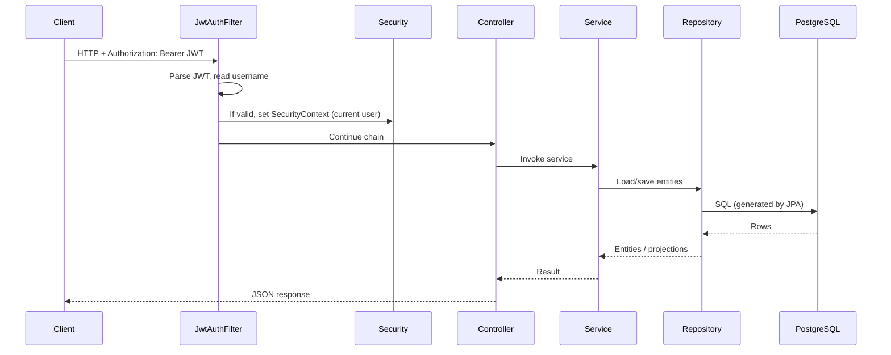

# EasyCode Mobile Backend — Bachelor’s Defense Cheat Sheet (English)

> For teammates who are **not** strong in backend: memorize **Sections 0 and 1** first, then read the rest as needed. Examiners care about **what you built, why you built it that way, and how data flows** — they will not ask you to write every line of code from memory.

---

## Section 0: A 30-second pitch — what does this backend do?

You can memorize or paraphrase this:

> This backend is a **REST API** for an **online programming education** product. Users can **sign up and log in** from a phone or browser, browse **published courses**, **enroll in free courses directly**, and for paid courses go through **checkout and payment confirmation** (in this repo, **mock payment** for easy demos). Logged-in users can **take a quiz after each lesson**; the system decides **pass/fail** from the score and can show **course-level learning progress** (lessons completed, quiz attempts, etc.).  
> Technically, **Spring Boot** exposes HTTP endpoints, **Spring Data JPA** talks to **PostgreSQL**, **Spring Security + JWT** handles authentication, and **Swagger (OpenAPI)** documents the API.

**Note:** The root `README.md` may still mention **MySQL** or **Stripe**. That can be **out of date**. For your defense, trust **`pom.xml`**, **`application.yml`**, and the **Java code** — do not memorize the wrong database name.

---

## Section 1: Terms you must know (examiners love these)

| Term | Plain language |
|------|----------------|
| **REST / RESTful API** | A convention: URLs + HTTP verbs (GET to read, POST to submit, etc.) + JSON bodies between client and server. |
| **Controller** | The layer that receives HTTP, calls business code, returns JSON (`controller` package). |
| **Service** | Where business rules live: can the user buy this, is the password correct, did the quiz pass (`service` package). |
| **Repository** | Database access: CRUD, usually interfaces extending `JpaRepository` (`repository` package). |
| **Entity** | Java classes mapped to tables, annotated with `@Entity` (`entity` package). |
| **DTO** | Objects shaped for **incoming requests** or **outgoing responses**, so you do not leak raw DB entities (`dto/request`, `dto/response`). |
| **JWT** | A **stateless** credential: the server signs a token; the client sends `Authorization: Bearer …` on each request; the server checks signature and expiry. |
| **`@Transactional`** | A group of DB operations **all succeed or all roll back**, avoiding inconsistent states like “money taken, course not granted”. |

---

## Section 2: Tech stack — “what we used”

| Area | In this project |
|------|------------------|
| Language / runtime | Java 17 |
| Framework | Spring Boot **3.3.x** |
| Web | spring-boot-starter-**web** |
| Data access | Spring Data **JPA** (Hibernate underneath) |
| Database | **PostgreSQL** (`spring.datasource` in `application.yml`) |
| Security | Spring **Security** + **JWT** (jjwt) |
| Validation | jakarta.validation (`@Valid` on controller inputs) |
| API docs | **springdoc-openapi** → Swagger UI in the browser |
| Build | **Maven** (`pom.xml`) |
| Tests | JUnit + Spring Boot Test; tests may use **H2** in memory (`src/test/resources/application-test.yml`) |

---

## Section 3: Project map — where to look in the repo

```
mobile-backend/src/main/java/com/easycode/backend/
├── EasyCodeApplication.java     # Entry point: Spring Boot bootstrap
├── config/                      # Security, CORS, Jackson, Swagger, etc.
├── controller/                  # HTTP layer (public URLs)
├── service/ and service/impl/    # Business logic
├── repository/                  # JPA data access
├── entity/                      # Table mappings
├── dto/request|response         # Request bodies / response VOs
├── security/                    # JWT issue/verify, filter, load user
├── exception/                   # Custom exceptions + global handler
└── common/                      # Unified wrapper Result, etc.
```

**Defense one-liner:** “We follow a classic layered style: thin Controllers, Services for rules, Repositories for persistence, Entities for the schema.”

---

## Section 4: How one request flows (must understand)

Example: **authenticated** call with a JWT:



**JwtAuthFilter** (`security/JwtAuthFilter.java`) reads the string after `Bearer`, **JwtService** extracts and validates the token, then installs the Spring Security **authentication** so `@AuthenticationPrincipal` can expose the logged-in username.

---

## Section 5: Security — who can call what

Configured in `config/SecurityConfig.java`:

- **Public (`permitAll`)** examples: `POST /api/token/`, `POST /api/signup/`, `POST /api/token/refresh/`, `GET /api/courses/`, `GET /api/course/**`, some GETs for videos/quizzes, `GET /api/payment-config/`, Swagger paths, etc.
- **Everything else** defaults to **`authenticated()`**.
- **Missing or invalid token** → **401 Unauthorized** (so the frontend interceptor can refresh tokens).

**Passwords:** On signup, passwords are stored with **BCrypt** (`PasswordEncoder`). On login, Spring Security’s **`DaoAuthenticationProvider`** verifies them.

---

## Section 6: Core business logic (by module)

### 6.1 Sign-up, login, refresh (Auth)

- **Signup** (`AuthServiceImpl.signup`): passwords must match; username/email unique → create **`User`** (bcrypt password) → default **`Profile`** (e.g. `STUDENT`) → issue **access + refresh** JWTs and **persist refresh** (revocation + rotation).
- **Login** (`login`): `AuthenticationManager` checks credentials → load user → same token issuance + refresh persistence.
- **Refresh** (`refreshToken`): refresh must exist in DB, not revoked, not expired, JWT type = refresh → **revoke old refresh** → issue **new pair** (**rotation**, safer).

### 6.2 Courses

- **List:** only courses with `isPublished == true` (`CourseServiceImpl.getAllCourses`).
- **Detail by `slug`:** full course; if the user is authenticated, compute **enrolled or not** via `UserCourse` for UI (“purchased” state).
- **My courses:** enrolled rows for the current user.
- **Free enroll:** `POST /check-out/{slug}/` only if **final price is 0**; otherwise user must use paid checkout.

### 6.3 Payment and enrollment (mock in this repo)

- **`createCheckoutSession`:** course exists, user exists, **not already enrolled**, **paid course** (`finalPrice > 0`) → generate `sessionId` → insert **pending** `UserPayment` → return URL to a **mock success page** (with `session_id`, etc.).
- **`confirmPayment`:** find payment by `session_id` → ensure it belongs to the user → if unpaid, mark paid + mock transaction id → **idempotent** if already paid → insert **`UserCourse`** if missing.

You can say in defense: a **real** system would call **Stripe / local PSP**; here **mock mode** avoids keys and compliance, but the **state machine** (pending → paid → enrolled) is realistic.

### 6.4 Quizzes and progress

- **Get quiz:** questions by `videoId`; if logged in, include whether the user **attempted** and **passed**.
- **Submit:** compare answers to `correctIndex` → score → **pass if** score ≥ `max(1, ceil(total * 0.7))` → upsert **`QuizAttempt`** per user+video.
- **Course progress:** counts total lessons, **completed** lessons from `VideoProgress`, quiz coverage, attempts/passes → `CourseProgressVO`.

**Honest note:** `VideoProgress` exists and **progress reads “completed” flags**. If your demo only uses this repo, be ready to explain **who writes** completion (another API, frontend, seed data, etc.).

### 6.5 Profile (User)

- **Read:** `GET /user/api/me/`.
- **Update:** email uniqueness if changed; names, bio, avatar, etc. (`UserServiceImpl`).

### 6.6 Dev helper (Admin)

- `AdminController` is `@Profile("!prod")` → **not registered in production profile**.
- `GET /api/admin/seed-quizzes`: bulk-insert **demo quiz questions** for videos that have none (hard-coded per course slug + lesson index).

---

## Section 7: HTTP endpoints quick reference (aligned with code)

> Default base URL `http://localhost:8080` (check `application.yml` for the port). Some paths end with **`/`** — keep the same as the frontend.

| Method | Path | Auth | Purpose |
|--------|------|------|---------|
| POST | `/api/token/` | No | Login |
| POST | `/api/signup/` | No | Register |
| POST | `/api/token/refresh/` | No | Refresh tokens (rotation) |
| GET | `/user/api/me/` | Yes | Current user |
| PATCH | `/user/api/me/` | Yes | Update profile |
| GET | `/api/courses/` | No | Published courses |
| GET | `/api/course/{slug}/` | Optional | Detail (+ enrollment if logged in) |
| GET | `/api/purchased-courses/` | Yes | Enrolled courses |
| POST | `/check-out/{slug}/` | Yes | Free course enroll |
| POST | `/api/create-checkout/{slug}/` | Yes | Create mock checkout |
| POST | `/api/confirm-payment/` | Yes | Confirm payment + enroll |
| GET | `/api/payment-config/` | No | Payment mode for frontend |
| GET | `/api/videos/{videoId}/quiz` | Per security config | Get quiz |
| POST | `/api/videos/{videoId}/quiz/submit` | Yes | Submit quiz |
| GET | `/api/course/{slug}/progress` | Yes | Course progress |
| GET | `/api/admin/seed-quizzes` | No (non-prod) | Seed demo quizzes |

Full schemas: run the app and open **Swagger UI** (often `http://localhost:8080/swagger-ui.html` or the springdoc default).

---

## Section 8: Database / entities (spoken explanation)

You only need to name **main tables and relationships**:

- **users** — accounts; **profiles** — usually **1:1** extension (role, bio, …).
- **courses**, **videos**, **course_materials** — one course, many lessons/materials; **course → teacher (User)** many-to-one.
- **user_courses** — enrollment (link table).
- **user_payments** — payment sessions / records, user + course.
- **quiz_questions**, **quiz_attempts** — questions bound to a **video**; attempts per user/video.
- **refresh_tokens** — persisted refresh tokens for revoke/rotate.
- **video_progress** — watch state (this API reads “completed” for progress).

JPA keywords you can mention: `@Entity`, `@Table`, `@Id`, `@OneToMany`, `@ManyToOne`, `@OneToOne` — **ORM maps classes to tables and relations so we write less raw SQL.**

---

## Section 9: Unified responses and errors

- Services throw typed exceptions: `BadRequestException`, `NotFoundException`, `UnauthorizedException`, etc.
- **`GlobalExceptionHandler`** (`@RestControllerAdvice`) maps them to **`Result`**: `code`, `message`, `data` (`common/Result.java`).
- **`@Valid`** failures (`MethodArgumentNotValidException`) also go through global handling.

---

## Section 10: Run locally (pre-defense checklist)

1. Install **JDK 17** and **Maven**.
2. Provide **PostgreSQL** (local or hosted). Configure `spring.datasource` in **`application.yml`**. **Never** commit real passwords or paste secrets into a public thesis PDF; use redacted screenshots or env vars for demos.
3. Set a long random **`jwt.secret`**; production should use env vars or a secret manager.
4. From `mobile-backend`: `mvn spring-boot:run` or `mvn clean package` then `java -jar target/...jar`.
5. Open Swagger; flow **register → login → copy access token → Authorize**.

Tests: `mvn test` uses test config (e.g. **H2**), isolated from production DB.

---

## Section 11: FAQ (short answers)

**Q: Why JWT instead of classic server sessions?**  
A: Fits SPA/mobile; less server-side session storage; refresh tokens in DB give revoke + rotation.

**Q: Why not store passwords in plain text?**  
A: If the DB leaks, attackers still cannot read original passwords; we use **BCrypt**.

**Q: Why split Service and Controller?**  
A: Separation of concerns; reusable/testable business logic; thin controllers.

**Q: `ddl-auto` in production?**  
A: Dev often uses `update`; production prefers **`validate`** or **Flyway/Liquibase** migrations to avoid accidental schema changes.

**Q: What is CORS?**  
A: Browser rule: if the page origin ≠ API origin, the server must allow the frontend origin (`CorsConfig`, `app.cors-allowed-origins`).

**Q: Mock vs real payment?**  
A: Real adds **PSP API + signature verification**; this project still shows **order state + enrollment**, which is the core e-learning commerce flow.

---

## Section 12: Three sentences for your cue card

Rewrite in first person:

1. **I implemented the backend API** with Spring Boot: users, courses, **mock** payments, quizzes, and progress.  
2. **Security:** Spring Security + JWT; sensitive routes need a token; BCrypt passwords; refresh token **rotation + revocation**.  
3. **Data:** JPA on PostgreSQL; rules in Services; errors as **`Result`**; Swagger for manual testing.

---

Good luck. If the examiner drills into code, use **Section 3** to find packages, then open **`SecurityConfig`**, **`AuthServiceImpl`**, **`CourseServiceImpl`**, **`PaymentServiceImpl`**, **`QuizServiceImpl`** — that covers most questions.
