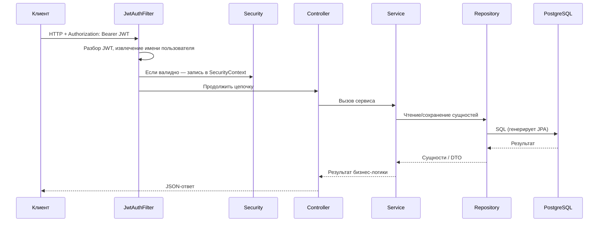

# EasyCode Mobile Backend — шпаргалка к защите диплома (русский)

> Для тех, кто **слабо** знает бэкенд: сначала выучите **разделы 0 и 1**, остальное читайте по необходимости. На защите спрашивают **что сделано, зачем так, как идут данные** — от вас **не** ждут, что вы напишете каждую строку кода с нуля.

---

## Раздел 0: За 30 секунд — что делает этот бэкенд

Можно заучить или пересказать своими словами:

> Это **REST API** для **онлайн-платформы обучения программированию**. Пользователь с телефона или браузера может **зарегистрироваться и войти**, смотреть **опубликованные курсы**, **сразу записаться на бесплатный курс**, а для платного — пройти **оформление и подтверждение оплаты** (в проекте сейчас **имитация оплаты** для демонстрации). После входа можно **проходить тест после урока**; система по баллам решает, **зачёт или нет**, и можно смотреть **прогресс по курсу** (сколько уроков завершено, сколько тестов и т.д.).  
> Технически: **Spring Boot** отдаёт HTTP, **Spring Data JPA** работает с **PostgreSQL**, **Spring Security + JWT** — аутентификация, **Swagger (OpenAPI)** — документация API.

**Важно:** в корневом `README.md` могут быть упоминания **MySQL** или **Stripe** — это может быть **устаревшим**. На защите ориентируйтесь на **`pom.xml`**, **`application.yml`** и **Java-код**, чтобы не назвать не ту СУБД.

---

## Раздел 1: Термины, которые стоит знать (их любят спрашивать)

| Термин | Простыми словами |
|--------|------------------|
| **REST / RESTful API** | Соглашение: URL + методы HTTP (GET читать, POST отправить и т.д.) + JSON между клиентом и сервером. |
| **Controller** | Слой, который принимает HTTP, вызывает бизнес-логику, отдаёт JSON (пакет `controller`). |
| **Service** | Правила предметной области: можно ли купить, верный ли пароль, зачтён ли тест (пакет `service`). |
| **Repository** | Работа с БД: CRUD, обычно интерфейсы `JpaRepository` (пакет `repository`). |
| **Entity** | Java-классы, соответствующие таблицам, с аннотацией `@Entity` (пакет `entity`). |
| **DTO** | Объекты **для входящих запросов** и **исходящих ответов**, чтобы не светить сущности БД наружу (`dto/request`, `dto/response`). |
| **JWT** | **Безсессионный** «пропуск»: сервер подписывает токен; клиент шлёт `Authorization: Bearer …`; сервер проверяет подпись и срок. |
| **`@Transactional`** | Набор операций с БД **либо все выполняются, либо откатываются**, без «списали деньги, а курс не открыли». |

---

## Раздел 2: Стек технологий — «что использовали»

| Область | В этом проекте |
|---------|----------------|
| Язык / среда | Java 17 |
| Фреймворк | Spring Boot **3.3.x** |
| Web | spring-boot-starter-**web** |
| Доступ к данным | Spring Data **JPA** (под капотом Hibernate) |
| СУБД | **PostgreSQL** (`spring.datasource` в `application.yml`) |
| Безопасность | Spring **Security** + **JWT** (jjwt) |
| Валидация | jakarta.validation (`@Valid` у параметров контроллера) |
| Документация API | **springdoc-openapi** → Swagger UI в браузере |
| Сборка | **Maven** (`pom.xml`) |
| Тесты | JUnit + Spring Boot Test; в тестах может быть **H2** (`src/test/resources/application-test.yml`) |

---

## Раздел 3: Карта проекта — где искать код

```
mobile-backend/src/main/java/com/easycode/backend/
├── EasyCodeApplication.java     # Точка входа Spring Boot
├── config/                      # Безопасность, CORS, Jackson, Swagger и т.д.
├── controller/                  # HTTP-слой (внешние URL)
├── service/ и service/impl/    # Бизнес-логика
├── repository/                  # JPA-доступ к данным
├── entity/                      # Маппинг таблиц
├── dto/request|response         # Тела запросов / ответы VO
├── security/                    # JWT, фильтр, загрузка пользователя
├── exception/                   # Свои исключения + глобальный обработчик
└── common/                      # Единый формат Result и т.п.
```

**Фраза на защиту:** «Классическое слоение: тонкие контроллеры, сервисы с правилами, репозитории к БД, сущности отражают схему.»

---

## Раздел 4: Как проходит один запрос (обязательно понять)

Пример: запрос **с JWT** к защищённому endpoint:



**JwtAuthFilter** (`security/JwtAuthFilter.java`) берёт строку после `Bearer`, **JwtService** извлекает имя пользователя и проверяет токен, затем в контекст Spring Security попадает **текущий пользователь** — после этого работает `@AuthenticationPrincipal`.

---

## Раздел 5: Безопасность — кто что может вызывать

Настройка в `config/SecurityConfig.java`:

- **Публично (`permitAll`)**, например: `POST /api/token/`, `POST /api/signup/`, `POST /api/token/refresh/`, `GET /api/courses/`, `GET /api/course/**`, часть GET для видео/тестов, `GET /api/payment-config/`, пути Swagger и др.
- **Всё остальное по умолчанию** — только **`authenticated()`**.
- **Нет токена или он невалиден** → **401 Unauthorized** (удобно для перехватчика на фронте и обновления access-токена).

**Пароли:** при регистрации — **BCrypt** (`PasswordEncoder`), при входе проверка через **`DaoAuthenticationProvider`** Spring Security.

---

## Раздел 6: Основная бизнес-логика (по модулям)

### 6.1 Регистрация, вход, обновление токена (Auth)

- **Регистрация** (`AuthServiceImpl.signup`): совпадение паролей, уникальность логина/email → **`User`** (bcrypt) → **`Profile`** по умолчанию (например `STUDENT`) → выдача **access + refresh** JWT и **сохранение refresh в БД** (отзыв и ротация).
- **Вход** (`login`): `AuthenticationManager` → пользователь → те же токены.
- **Refresh** (`refreshToken`): токен есть в БД, не отозван, не истёк, тип refresh → **отозвать старый refresh** → выдать **новую пару** (**ротация**, безопаснее).

### 6.2 Курсы

- **Список:** только курсы с `isPublished == true` (`getAllCourses`).
- **Детали по `slug`:** полное описание; если пользователь авторизован — флаг **записан ли** (`UserCourse`) для UI.
- **Мои курсы:** записи текущего пользователя.
- **Бесплатная запись:** `POST /check-out/{slug}/` только если **итоговая цена 0**; иначе — платный сценарий.

### 6.3 Оплата и запись на курс (сейчас — мок)

- **`createCheckoutSession`:** курс есть, пользователь есть, **ещё не записан**, курс **платный** (`finalPrice > 0`) → `sessionId` → строка **`UserPayment`** со статусом ожидания → URL **имитации успешной оплаты** (с `session_id` и т.д.).
- **`confirmPayment`:** поиск по `session_id` → проверка владельца → если не оплачено — отметить оплату + mock-транзакция → **идемпотентность**, если уже оплачено → **`UserCourse`**, если ещё нет.

На защите: в **боевой** системе был бы **эквайринг**; здесь **mock** снижает риски с секретами, но **конечный автомат** (ожидание → оплачено → запись на курс) сохранён.

### 6.4 Тесты и прогресс

- **Получить тест:** вопросы по `videoId`; если залогинен — флаги **пытался / сдал**.
- **Отправка ответов:** сравнение с `correctIndex` → балл → **зачёт**, если балл ≥ `max(1, ceil(всего * 0.7))` → upsert **`QuizAttempt`** на пару пользователь+видео.
- **Прогресс по курсу:** число уроков, **завершённые** по `VideoProgress`, тесты, попытки/зачёты → `CourseProgressVO`.

**Честно:** сущность **`VideoProgress`** есть, прогресс **читает** флаг «завершено». Будьте готовы сказать, **кто пишет** это поле (другой API, фронт, сиды), если спросят только про этот репозиторий.

### 6.5 Профиль (User)

- **Чтение:** `GET /user/api/me/`.
- **Обновление:** уникальность email при смене; имя, bio, avatar и т.д. (`UserServiceImpl`).

### 6.6 Вспомогательное для разработки (Admin)

- `AdminController` с `@Profile("!prod")` → в **prod** бин **не** создаётся.
- `GET /api/admin/seed-quizzes`: массовая подстановка **демо-вопросов** для видео без вопросов (жёстко в коде по slug курса и номеру урока).

---

## Раздел 7: Основные HTTP-эндпоинты (как в коде)

> База по умолчанию `http://localhost:8080` (порт — в `application.yml`). Часть путей с **`/`** в конце — как на фронте.

| Метод | Путь | Нужен вход | Назначение |
|--------|------|------------|------------|
| POST | `/api/token/` | Нет | Вход |
| POST | `/api/signup/` | Нет | Регистрация |
| POST | `/api/token/refresh/` | Нет | Обновление токенов (ротация) |
| GET | `/user/api/me/` | Да | Текущий пользователь |
| PATCH | `/user/api/me/` | Да | Обновление профиля |
| GET | `/api/courses/` | Нет | Список опубликованных курсов |
| GET | `/api/course/{slug}/` | Опционально | Детали (+ запись, если залогинен) |
| GET | `/api/purchased-courses/` | Да | Мои курсы |
| POST | `/check-out/{slug}/` | Да | Бесплатная запись |
| POST | `/api/create-checkout/{slug}/` | Да | Создать мок-сессию оплаты |
| POST | `/api/confirm-payment/` | Да | Подтвердить оплату и записать |
| GET | `/api/payment-config/` | Нет | Режим оплаты для фронта |
| GET | `/api/videos/{videoId}/quiz` | По Security | Получить тест |
| POST | `/api/videos/{videoId}/quiz/submit` | Да | Отправить ответы |
| GET | `/api/course/{slug}/progress` | Да | Прогресс по курсу |
| GET | `/api/admin/seed-quizzes` | Нет (не prod) | Заполнить демо-тесты |

Полные схемы: запустить приложение и открыть **Swagger UI** (часто `http://localhost:8080/swagger-ui.html` или путь по умолчанию springdoc).

---

## Раздел 8: База и связи сущностей (устно)

Достаточно перечислить **основные таблицы и связи**:

- **users** — учётные записи; **profiles** — чаще **1:1** (роль, bio, …).
- **courses**, **videos**, **course_materials** — у курса много уроков и материалов; **курс → преподаватель (User)** многие-к-одному.
- **user_courses** — запись пользователя на курс.
- **user_payments** — платежи/сессии, пользователь + курс.
- **quiz_questions**, **quiz_attempts** — вопросы привязаны к **video**; попытки по пользователю и видео.
- **refresh_tokens** — refresh в БД для отзыва и ротации.
- **video_progress** — прогресс просмотра (API прогресса читает «завершено»).

Про JPA: `@Entity`, `@Table`, `@Id`, `@OneToMany`, `@ManyToOne`, `@OneToOne` — **ORM связывает классы с таблицами и внешними ключами, меньше ручного SQL.**

---

## Раздел 9: Единый ответ и ошибки

- В сервисах — свои исключения: `BadRequestException`, `NotFoundException`, `UnauthorizedException` и др.
- **`GlobalExceptionHandler`** (`@RestControllerAdvice`) переводит их в **`Result`**: `code`, `message`, `data` (`common/Result.java`).
- Ошибки **`@Valid`** (`MethodArgumentNotValidException`) тоже через глобальный обработчик.

---

## Раздел 10: Запуск локально (чеклист перед защитой)

1. Установить **JDK 17** и **Maven**.
2. Поднять **PostgreSQL** (локально или облако), прописать `spring.datasource` в **`application.yml`**. **Не** коммитьте реальные пароли и **не** вставляйте секреты в открытую работу/скриншоты — для демо лучше переменные окружения или замазанные значения.
3. **`jwt.secret`** — длинная случайная строка; в проде — секрет-хранилище или env.
4. В каталоге `mobile-backend`: `mvn spring-boot:run` или `mvn clean package` и `java -jar target/...jar`.
5. Swagger: цепочка **регистрация → вход → access token → Authorize**.

Тесты: `mvn test` с тестовым профилем (например **H2**), отдельно от боевой БД.

---

## Раздел 11: Частые вопросы (коротко)

**П: Зачем JWT, а не классические сессии на сервере?**  
О: Удобно для SPA/мобилки; меньше хранения сессий на сервере; refresh в БД даёт отзыв и ротацию.

**П: Почему пароль не в открытом виде?**  
О: При утечке БД злоумышленник не получает исходный пароль; используем **BCrypt**.

**П: Зачем отдельно Service и Controller?**  
О: Разделение ответственности, переиспользование логики, тесты, тонкие контроллеры.

**П: `ddl-auto` на проде?**  
О: В разработке часто `update`; на проде лучше **`validate`** или миграции **Flyway/Liquibase**.

**П: Что такое CORS?**  
О: Политика браузера: если origin фронта ≠ origin API, сервер должен разрешить origin фронта (`CorsConfig`, `app.cors-allowed-origins`).

**П: Чем мок-оплата отличается от настоящей?**  
О: Нет вызова **платёжного шлюза и проверки подписи**; при этом виден **жизненный цикл заказа и записи на курс**.

---

## Раздел 12: Три фразы на карточку

Перепишите от первого лица:

1. **Я делал backend API** на Spring Boot: пользователи, курсы, **мок**-оплата, тесты, прогресс.  
2. **Безопасность:** Spring Security + JWT; чувствительные операции только с токеном; пароли **BCrypt**; refresh с **ротацией и отзывом**.  
3. **Данные:** JPA + PostgreSQL; правила в сервисах; ошибки в **`Result`**; Swagger для ручной проверки.

---

Удачи на защите. Если копают в код — **раздел 3** (пакеты), затем файлы **`SecurityConfig`**, **`AuthServiceImpl`**, **`CourseServiceImpl`**, **`PaymentServiceImpl`**, **`QuizServiceImpl`** закрывают большинство вопросов.
