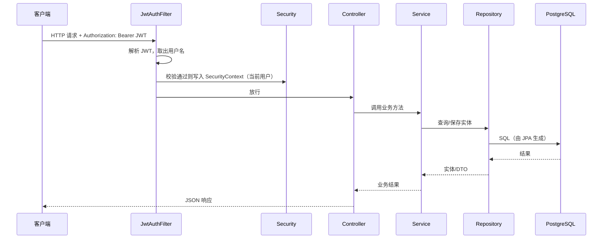

# EasyCode Mobile 后端 — 本科答辩傻瓜指南

> 面向「几乎零基础」的同学：先把下面 **第 0、1 节背熟**，再按兴趣读业务与代码细节。答辩时老师问的是「你做了什么、为什么这样做、数据怎么流转」，不要求你手写每一行代码。

---

## 第 0 节：30 秒说清楚「这个后端是干什么的」

你可以原样背诵或改写成自己的话：

> 本项目后端是一个 **在线编程教育平台** 的 **REST API 服务**。用户可以在手机或浏览器里 **注册登录**，浏览 **已发布的课程**，**免费课直接选课**，**付费课走下单与确认支付流程**（当前工程里是 **模拟支付**，方便演示）。登录用户可以 **做每节课后的测验**，系统根据得分判断是否 **通过**，并可以查询 **整门课的学习进度**（已学完课时数、测验完成情况等）。  
> 技术实现上，我用 **Spring Boot** 提供 HTTP 接口，用 **Spring Data JPA** 访问 **PostgreSQL** 数据库，用 **Spring Security + JWT** 做身份认证，接口文档用 **Swagger（OpenAPI）** 展示。

**注意**：仓库根目录里 `README.md` 部分内容（如 MySQL、Stripe）可能与当前 `application.yml` 和代码不一致，**以实际运行的 `pom.xml`、`application.yml` 和 Java 代码为准**，答辩时不要背错数据库名字。

---

## 第 1 节：必须认识的几个词（老师爱问）

| 词 | 白话 |
|----|------|
| **REST / RESTful API** | 用 URL + HTTP 方法（GET 查、POST 提交等）和前端交换 JSON 数据的一种约定。 |
| **Controller** | 接收 HTTP 请求、调用业务、返回 JSON 的那一层（`controller` 包）。 |
| **Service** | 写业务规则的地方：能不能买、密码对不对、测验算不算过（`service` 包）。 |
| **Repository** | 和数据库打交道：增删改查，一般是接口继承 `JpaRepository`（`repository` 包）。 |
| **Entity** | 和数据库表一一对应的 Java 类，带 `@Entity`（`entity` 包）。 |
| **DTO** | 专门用来「接请求 / 返回给前端」的数据结构，避免把数据库实体直接暴露出去（`dto/request`、`dto/response`）。 |
| **JWT** | 一种「无状态」的登录凭证：服务器签发一串 token，前端每次请求放在 `Authorization: Bearer ...` 里，服务器验证签名和有效期。 |
| **事务 `@Transactional`** | 一组数据库操作要么全成功要么全失败，避免「钱扣了课没开通」这种半成品数据。 |

---

## 第 2 节：技术栈（答辩「用了什么」清单）

| 类别 | 实际项目里用的 |
|------|----------------|
| 语言 / 运行环境 | Java 17 |
| 框架 | Spring Boot **3.3.x** |
| Web | spring-boot-starter-**web** |
| 数据库访问 | Spring Data **JPA**（底层是 Hibernate） |
| 数据库 | **PostgreSQL**（配置在 `application.yml` 的 `spring.datasource`） |
| 安全 | Spring **Security** + **JWT**（jjwt） |
| 参数校验 | jakarta.validation（Controller 入参上的 `@Valid`） |
| 接口文档 | **springdoc-openapi** → 浏览器里 Swagger UI |
| 构建 | **Maven**（`pom.xml`） |
| 测试 | JUnit + Spring Boot Test；测试环境可用 **H2** 内存库（见 `src/test/resources/application-test.yml`） |

---

## 第 3 节：项目目录「地图」（知道去哪找代码）

```
mobile-backend/src/main/java/com/easycode/backend/
├── EasyCodeApplication.java     # 程序入口：Spring Boot 启动类
├── config/                      # 全局配置：安全、跨域、Jackson、Swagger 等
├── controller/                  # HTTP 接口层（对外 URL）
├── service/ 与 service/impl/    # 业务逻辑层
├── repository/                  # 数据访问层（JPA）
├── entity/                      # 数据库表映射
├── dto/request|response         # 请求体 / 响应视图对象
├── security/                    # JWT 生成校验、过滤器、加载用户信息
├── exception/                   # 自定义异常 + 全局异常处理
└── common/                      # 统一返回体 Result 等
```

**答辩话术**：「我按经典三层架构组织：Controller 只做参数和转发，Service 写业务，Repository 访问数据库，Entity 映射表结构。」

---

## 第 4 节：一次请求是怎么走的（必会流程）

下面用「用户带 token 访问需要登录的接口」举例：



**JwtAuthFilter**（`security/JwtAuthFilter.java`）从请求头取出 `Bearer` 后面的字符串，用 **JwtService** 解析用户名并校验 token，再把 Spring Security 需要的「当前用户」放进上下文，后面的 `@AuthenticationPrincipal` 才能拿到登录用户名。

---

## 第 5 节：安全策略 — 哪些接口谁可以访问

配置在 `config/SecurityConfig.java`：

- **不需要登录（permitAll）** 的典型接口：登录 `POST /api/token/`、注册 `POST /api/signup/`、刷新 token `POST /api/token/refresh/`、课程列表与详情 `GET /api/courses/`、`GET /api/course/**`、与视频测验相关的部分 GET、支付配置 `GET /api/payment-config/`、Swagger 文档路径等。
- **其它请求默认需要登录**（`anyRequest().authenticated()`）。
- **无 token 或 token 无效** 时，配置了返回 **401 Unauthorized**，方便前端用拦截器做「自动刷新 token」之类的逻辑。

**密码**：注册时使用 **BCrypt** 加密后再存入数据库（`PasswordEncoder`），登录时由 Spring Security 的 `DaoAuthenticationProvider` 验密。

---

## 第 6 节：核心业务逻辑（按模块背）

### 6.1 注册与登录（Auth）

- **注册**（`AuthServiceImpl.signup`）：检查两次密码一致、用户名/邮箱不重复 → 创建 `User`（密码 bcrypt）→ 创建默认 `Profile`（角色如 `STUDENT`）→ 签发 **access + refresh** 两个 JWT，并把 refresh token **落库**（可吊销、可轮换）。
- **登录**（`login`）：用 `AuthenticationManager` 验用户名密码 → 查用户 → 同样签发 token 并保存 refresh。
- **刷新**（`refreshToken`）：校验 refresh 在数据库存在、未吊销、未过期、且 JWT 类型为 refresh → **吊销旧 refresh** → 签发 **新的一对** token（**轮换机制**，更安全）。

### 6.2 课程（Course）

- **课程列表**：只返回 `isPublished == true` 的课（`CourseServiceImpl.getAllCourses`）。
- **课程详情**：按 `slug` 查课及章节等；若请求里带了有效登录态，会计算当前用户是否 **已选课**（`UserCourse` 是否存在），用于前端展示「已购/未购」等。
- **我的课表**：登录用户通过 `UserCourse` 查已选课程列表。
- **免费选课**：`POST /check-out/{slug}/` — 仅当课程 **实付价为 0** 时允许直接写入 `UserCourse`；否则提示走付费流程。

### 6.3 支付与选课（Payment — 当前为模拟）

- **创建结账会话** `createCheckoutSession`：校验课程存在、用户存在、**未重复选课**、课程为 **付费**（`finalPrice > 0`）→ 生成 `sessionId` → 在 `UserPayment` 表插入一条 **待支付** 记录 → 返回给前端一个 **模拟支付成功页** 的 URL（带上 `session_id` 等参数）。
- **确认支付** `confirmPayment`：按 `session_id` 找到待支付记录 → 校验属于当前用户 → 若未支付则标记为已支付并写入模拟交易号 → **幂等**：若已支付则直接返回课程信息 → 在 `UserCourse` 中 **插入选课记录**（若尚无）。

答辩时可以说：**真实环境可对接支付宝/微信/Stripe**，本毕设用 **mock 模式** 降低密钥与合规成本，但 **业务状态机**（待支付 → 已支付 → 选课）是完整的。

### 6.4 测验与课程进度（Quiz）

- **取测验**：按 `videoId` 拉题目列表；若已登录，附带该用户对本视频是否 **做过、是否通过**。
- **交卷**：比对每题用户选项与 `correctIndex` → 算分 → **及格线**：得分 ≥ `max(1, ceil(总题数 * 0.7))` → 写入或更新 `QuizAttempt`（同一用户同一视频一条记录上更新分数与是否通过）。
- **课程进度**：统计该课总课时、用户 `VideoProgress` 里标记 **已完成** 的课时数、有题库的视频数、用户已尝试/已通过测验数等，封装成 `CourseProgressVO`。

说明：`VideoProgress` 实体与仓库在本项目中存在，**课程进度统计会读取「已完成」的观看记录**；若你答辩现场只演示本仓库，需如实说明「观看完成」数据来自哪里（例如是否由前端或其它接口写入），避免老师追问时答不上。

### 6.5 个人资料（User）

- **读当前用户**：`/user/api/me/`。
- **更新资料**：邮箱改重时做唯一性校验；可更新姓名、邮箱、Profile 里的 bio、avatar 等（见 `UserServiceImpl`）。

### 6.6 开发辅助（Admin）

- `AdminController` 带 `@Profile("!prod")`，**生产 profile 下不会注册该 Bean**。
- `GET /api/admin/seed-quizzes`：给没有题目的视频 **批量插入演示用测验题**（代码里按课程 slug + 课序号写死题目），答辩演示数据不够时可访问一次。

---

## 第 7 节：主要 HTTP 接口速查（与代码一致）

> 基础路径默认 `http://localhost:8080`（端口以 `application.yml` 为准）。**末尾斜杠** 有的路径带 `/`，调用时与前端保持一致。

| 方法 | 路径 | 是否需要登录 | 作用 |
|------|------|----------------|------|
| POST | `/api/token/` | 否 | 登录 |
| POST | `/api/signup/` | 否 | 注册 |
| POST | `/api/token/refresh/` | 否 | 刷新 token（轮换） |
| GET | `/user/api/me/` | 是 | 当前用户信息 |
| PATCH | `/user/api/me/` | 是 | 更新资料 |
| GET | `/api/courses/` | 否 | 已发布课程列表 |
| GET | `/api/course/{slug}/` | 可选 | 课程详情（登录则可知是否已选） |
| GET | `/api/purchased-courses/` | 是 | 已选课程 |
| POST | `/check-out/{slug}/` | 是 | 免费课直接选课 |
| POST | `/api/create-checkout/{slug}/` | 是 | 创建模拟支付会话 |
| POST | `/api/confirm-payment/` | 是 | 确认支付并入课 |
| GET | `/api/payment-config/` | 否 | 前端读取支付模式等 |
| GET | `/api/videos/{videoId}/quiz` | 按安全配置 | 获取测验题 |
| POST | `/api/videos/{videoId}/quiz/submit` | 是 | 提交测验 |
| GET | `/api/course/{slug}/progress` | 是 | 课程学习进度 |
| GET | `/api/admin/seed-quizzes` | 否（非 prod） | 填充演示测验 |

更完整的参数与返回结构：启动项目后打开 **Swagger UI**（一般为 `http://localhost:8080/swagger-ui.html` 或 springdoc 默认路径）。

---

## 第 8 节：数据库与实体关系（口语化）

你不需要画得很专业，能说清 **「几张关键表、之间什么关系」** 即可：

- **users**：账号（用户名、邮箱、密码等）；与 **profiles** 一般是一对一扩展资料与角色。
- **courses**、**videos**、**course_materials**：一门课多节课、多个资料；**course** 与 **teacher（User）** 多对一。
- **user_courses**：用户与课程的 **选课关系**（中间表）。
- **user_payments**：支付流水 / 会话，关联用户与课程。
- **quiz_questions**、**quiz_attempts**：题目挂在某个 **video** 上；每个用户对每个视频可有测验记录。
- **refresh_tokens**：刷新令牌持久化，用于吊销与轮换。
- **video_progress**：用户观看进度（本项目中进度接口会读「已完成」标记）。

JPA 里常用注解：`@Entity`、`@Table`、`@Id`、`@OneToMany`、`@ManyToOne`、`@OneToOne` 等，答辩可以说：**「用对象关系映射，让 Java 类对应表与外键关系，减少手写 SQL。」**

---

## 第 9 节：统一返回与异常（老师问「出错前端怎么看」）

- 业务里抛出自定义异常，例如 `BadRequestException`、`NotFoundException`、`UnauthorizedException`。
- `GlobalExceptionHandler`（`@RestControllerAdvice`）集中捕获，返回统一结构 **`Result`**：`code`、`message`、`data`（见 `common/Result.java`）。
- 参数校验失败：`@Valid` 触发 `MethodArgumentNotValidException` 时也会走全局处理。

---

## 第 10 节：本地运行（答辩前自检）

1. 安装 **JDK 17**、**Maven**。
2. 准备 **PostgreSQL** 或可连接的托管库，在 **`application.yml`** 中配置 `spring.datasource`（**不要把含密码的配置提交到公开仓库或写进论文截图**；答辩演示可用本地库或脱敏配置）。
3. `jwt.secret` 使用足够长的随机串；生产环境应使用环境变量或密钥管理服务。
4. 在项目目录执行：`mvn spring-boot:run` 或先 `mvn clean package` 再 `java -jar target/...jar`。
5. 浏览器访问 Swagger，用「注册 → 登录 → 复制 access token → Authorize」走通一条链路。

测试：`mvn test` 会使用测试配置（如 H2），与生产库隔离。

---

## 第 11 节：高频答辩问答（简答）

**Q：为什么用 JWT 而不是传统 Session？**  
A：适合前后端分离与移动端；服务器不必在内存里存每个会话，扩展相对方便；refresh token 存库可兼顾安全与吊销。

**Q：密码为什么不明文存？**  
A：数据库泄露时攻击者无法直接得到原始密码；我们使用 BCrypt 单向哈希。

**Q：Service 和 Controller 为什么要分开？**  
A：职责分离，业务可复用、可单测，Controller 保持轻薄。

**Q：JPA 的 ddl-auto 在生产要注意什么？**  
A：开发常用 `update` 自动改表；生产更常见 `validate` 或只用迁移工具（Flyway/Liquibase），避免误改表结构。

**Q：CORS 是什么？**  
A：浏览器安全策略：前端页面在一个域名，API 在另一个域名时，要在服务端配置允许的来源（见 `CorsConfig` 与 `app.cors-allowed-origins`）。

**Q：模拟支付和真实支付差在哪？**  
A：差在「是否调用第三方支付网关与验签」；本项目的 **订单状态与选课** 逻辑已经演示了电商类系统的核心流程。

---

## 第 12 节：给你自己的「答辩备忘三句话」

把下面改成第一人称，抄在卡片上：

1. **我负责的是后端 API**，用 Spring Boot 实现用户、课程、支付（模拟）、测验与进度统计。  
2. **安全上** 使用 Spring Security + JWT，敏感操作要带 token，密码 BCrypt 存储，刷新 token 支持轮换与吊销。  
3. **数据层** 用 JPA 操作 PostgreSQL，业务写在 Service，异常统一返回 `Result`，并用 Swagger 自测接口。

---

祝答辩顺利。若老师追问到某一段具体代码，打开本指南 **第 3 节目录** 定位包名，再对照 `SecurityConfig`、`AuthServiceImpl`、`CourseServiceImpl`、`PaymentServiceImpl`、`QuizServiceImpl` 五个类即可覆盖大部分问题。
